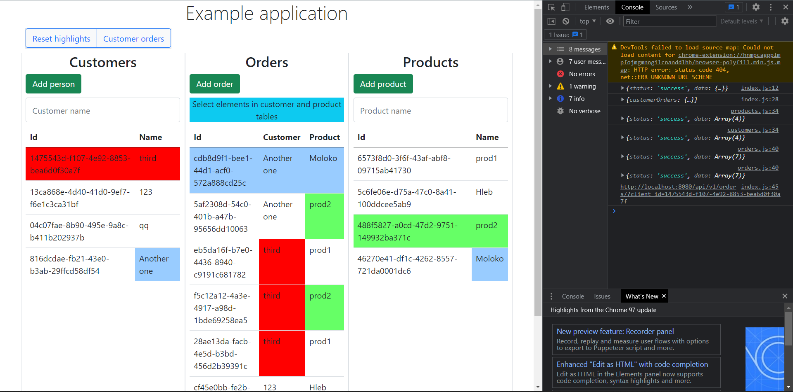

# Example application of microservices
Task:  https://github.com/KazanExpress/wms-backend-test-task/blob/master/README.md 

Application consists of 4 services
All services are based on task, link to which is given at start of README (not to duplicate entities and goal) 

Customer, Order and Product services has 3 endpoints (without parameters)
 - GET /api/v1/{resource} which will return all entities
 - GET /api/v1/{resource}/{id} which will return entity by id
 - POST /api/v1/{resource} which will **create** and return entity
 
Additional Order-service has endpoint with parameter:
 - GET /api/v1/orders?clientId={clientId} which will return all entities of this client

Gateway service has 3 endpoints:
 - GET / returns html home page
 - GET /api returns all available links
 - GET /api/v1/orders?client_id={client_id} returns all orders for this client

Each service was build on different technologies:
 - Customer service
   - NOSQL Redis database
   - Spring data repositories
   - Synchronous Spring MVC
 - Product service
   - NOSQL Redis database
   - Database access based on RedisTemplate (JdbcTemplate analog)
   - Spring WebFlux (Functional endpoints)
 - Order service
   - SQL Postgresql
   - JPA/Spring data repositories
   - Synchronous Spring MVC
 - Gateway service
   - Experimented with HATEOAS but not very useful (only 2 endpoints and lazy to write good client)
   - Jquery/Bootstrap client (Badly written as a not a frontend developer) but somewhat working
   - Asynchronous call to other services (with spring @Async) 
 
Application available via docker (sadly each image is >200 mb, be aware of it, i know it can be compressed more, but lazy to do it):

`docker-compose -f docker-compose-prod.yml up`

And lastly preview application image:

